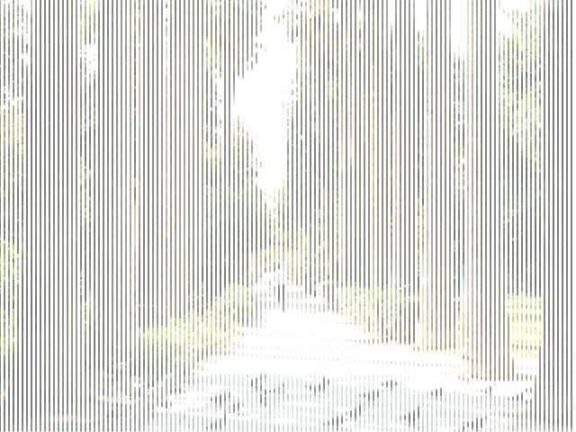
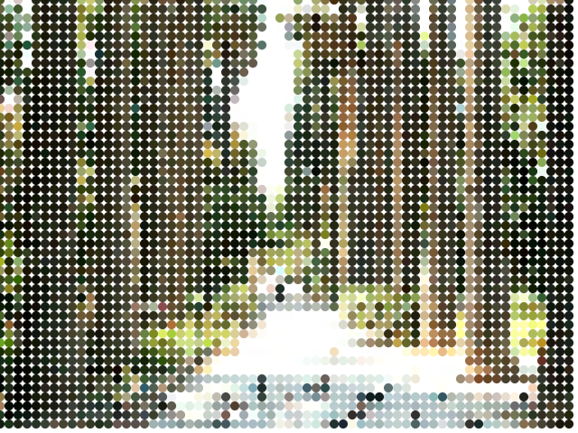
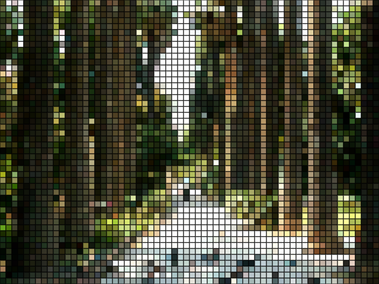
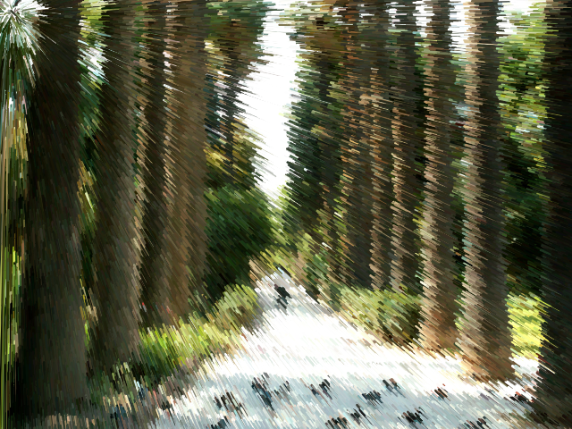
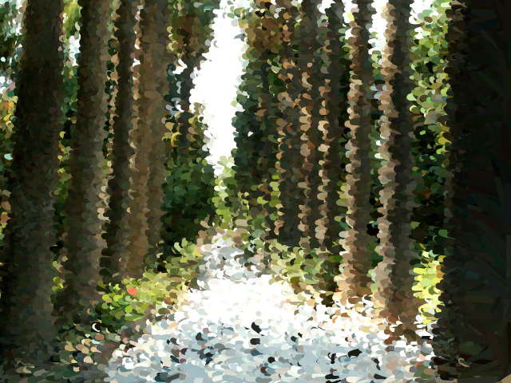

# Manipulações de Imagens feitas com p5.js

Exemplos de manipulação de imagens usando a biblioteca p5.js feitas na live do Código Várzea

## Imagens manipuladas:

### Linha

### Pontos

### Rect

### Borrada

### Rotacionada
